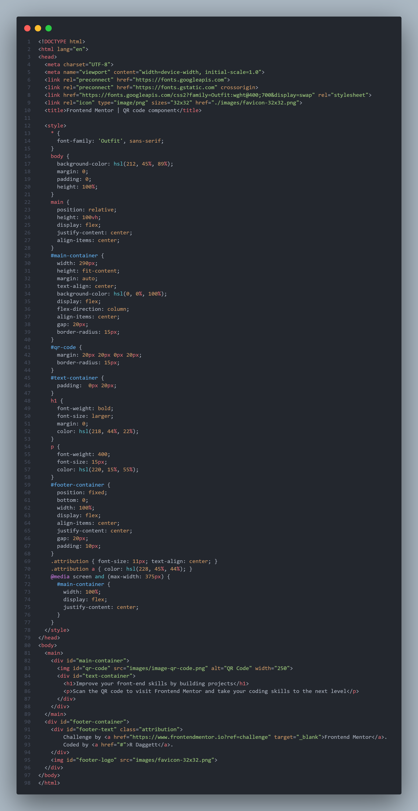

# Frontend Mentor - QR code component solution

This is a solution to the [QR code component challenge on Frontend Mentor](https://www.frontendmentor.io/challenges/qr-code-component-iux_sIO_H). Frontend Mentor challenges help you improve your coding skills by building realistic projects. 

## Table of contents

- [Overview](#overview)
  - [Screenshot](#screenshot)
  - [Links](#links)
- [My process](#my-process)
  - [Built with](#built-with)
  - [Continued development](#continued-development)
  - [Useful resources](#useful-resources)
- [Author](#author)

## Overview

  ### Screenshot

  

  ### Links

  - Solution URL: [Github Repo](https://github.com/daggettt/QRCodeComponentChallenge)
  - Live URL: [Github Pages](https://daggettt.github.io/QRCodeComponentChallenge/)

## My process

  ### Built with

  - Semantic HTML5 markup
  - CSS custom properties
  - Flexbox

  ### Continued development

  I'd like to strengthen my understanding of CSS workflow - especially when working with flexbox. Hoping to make this process feel a little more intuitive. Also, need to work more with responsive design. 

  ### Useful resources

  - [W3Schools: CSS Layout Horizontal & Vertical Align](https://www.w3schools.com/css/css_align.asp) - This helped me with centering items (vertically and horizontally).

## Author

- Frontend Mentor - [@daggettt](https://www.frontendmentor.io/profile/daggettt)
- Github - [@daggettt](https://github.com/daggettt)

